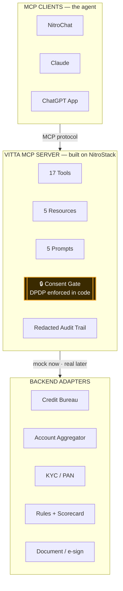

<div align="center">

# 🏦 Vitta

> **Compliant-by-design lending, expressed as a Model Context Protocol server.**

A **consent-native MCP server** for NBFC personal-loan origination, enabling **any AI client to take a
borrower from _“hi”_ to a signed sanction letter** — through consent enforced *in code*, explainable
underwriting, and a what-if simulator that turns a *“no”* into a path to *“yes.”*

Unlike a chatbot bolted onto a lending backend, this system:
- **Enforces DPDP consent at the tool layer** — data-pull tools *physically refuse* to run without a valid, scoped, lead-bound token.
- **Explains every decision** with rules + reason codes — no black-box model, nothing to fabricate under questioning.
- **Is one server, many clients** — the same tools power NitroChat, Claude, or a ChatGPT App with **no rewrite**.


**Amrita University · MCP Hackathon 2026 · Team _The Beetles_**

[🌐 Live Server](https://vitta-6a5a5835-the-beetles-amrita-university-amritapuri-campus.app.nitrocloud.ai) · [🎬 Demo Video](#-example-run) · [⚡ Quick Start](#️-quick-start) · [🔒 Consent-as-Code](#-key-innovations)

</div>

---

## 🧭 TL;DR

- **Problem:** NBFC loan origination is a leaky, compliance-heavy maze; data is pulled with murky consent, and declines come with no reason and no path forward.
- **Solution:** One MCP server that exposes the entire loan workflow as Tools, Resources & Prompts — the AI client is the loan officer, the server is the capability layer.
- **Core Innovation:** **Consent-as-code** — a scoped, time-boxed, revocable, lead-bound token that gated tools *require*; DPDP law compiled into the server.
- **Impact:**
  - **17 Tools · 5 Resources · 5 Prompts · 4 Widgets** — all three MCP primitives, live in production.
  - **5/5 adversarial security probes held** · **34/34 tests** · **11/11 production checks**.
  - The whole funnel collapses into **one auditable, explainable conversation** — reusable across every channel with no rewrite.

---

## 🎯 Problem Statement

Existing NBFC origination suffers from:
- **Leakage** — every hop (qualify → consent → KYC → bureau → offer) loses applicants to forms and portals.
- **Opacity** — declines rarely come with a clear, lawful reason or a way to improve.
- **Consent theatre** — sensitive bureau/bank data is pulled behind vague checkboxes, not provable consent.

This leads to:
- **Regulatory risk** (DPDP / RBI / KYC obligations that must be *provable*, not assumed).
- **Borrower distrust and drop-off** — people abandon a process they don’t understand and can’t question.

---

## 🎯 Design Goals

- **Compliance-first** — consent, audit, and disclosures enforced by the system, not by good intentions.
- **Deterministic** — identical, repeatable outcomes for a reliable demo and reproducible decisions.
- **Explainable** — every decision carries reason codes and plain-English text; no black box.
- **Composable** — one MCP server reusable by any client, any channel.
- **Robust** — test-first on the load-bearing logic; survives adversarial prompting and token attacks.

---

## 💡 Key Innovations

1. **Consent-as-Code (the signature idea)**
   → `pull_bureau` and `fetch_bank_statements` call `validConsent()` as their **first line** and refuse
   without a valid HMAC token that is **scoped**, **time-boxed (15 min)**, **revocable**, and **bound to the
   applicant**. No prompt can talk the AI past it — the gate lives in the server. *DPDP, expressed as software.*

2. **The What-If Simulator**
   → `simulate_scenario` re-runs the **real** affordability + underwriting with one changed lever
   (“close a ₹4,000 EMI”, “48-month tenure”) **without mutating the application**, and shows the exact delta:
   *CONDITIONAL ₹2.5L → APPROVE ₹3L.* It turns a rejection into a roadmap.

3. **One Server, Many Clients**
   → Because the logic is a standard MCP server, the same tool suite powers a branded chat, Claude, a ChatGPT
   App, or (roadmap) WhatsApp and an underwriter console — standard contracts, versioned policy, one audit trail.

4. **Explainability without ML overclaim**
   → Rules + a pre-baked scorecard + reason codes → borrower-friendly text (localised EN/HI/ML). We never
   claim a trained model we didn’t train — honest and defensible under a judge’s questioning.

---

## 🧠 Why This Works

Traditional approaches fail because:
- **A monolithic multi-agent app** hides orchestration inside itself, can’t be reused, and dilutes the MCP story.
- **Prompt-level “please get consent”** is not enforcement — any jailbreak or clever phrasing bypasses it.
- **A black-box ML score** collapses the moment a judge (or a regulator) asks *“how does it decide?”*

This system succeeds because it models compliance as three concrete things:
- **Consent** as a cryptographic, scoped capability token checked at the tool boundary.
- **Explainability** as deterministic reason codes mapped to human language.
- **Auditability** as an append-only, PII-redacted, version-stamped event log.

→ **Result:** compliance becomes the *feature*, not the overhead — and it’s provable, not asserted.

---

## 🏗️ System Architecture



**The Golden Path** — every arrow is an MCP tool call chosen by the client:

```mermaid
flowchart LR
  A([qualify_lead]) --> B([record_consent<br/>issues token])
  B --> C([verify_kyc]) --> D([screen_fraud]) --> E([pull_bureau]) --> F([fetch_bank_statements])
  F --> G([compute_affordability]) --> H([underwrite]) --> I([generate_offers]) --> J([create_sanction_letter]) --> K([audit_trail])
  classDef gate fill:#3a2a00,stroke:#f5a623,stroke-width:2px,color:#fff;
  classDef issuer fill:#04322e,stroke:#2dd4bf,stroke-width:2px,color:#fff;
  class E,F gate;
  class B issuer;
```



---

## 🧩 System Components

### 1. Pure Decisioning Engine (`src/lib/`)
- **What it does:** all business logic — consent tokens, scorecard, EMI/APR math, affordability, offers,
  sanction letter, PII redaction, the what-if simulator — as pure, deterministic, dependency-free modules.
- **How it works:** zero platform imports and an injectable clock, so it’s fully unit-testable. The MCP tools
  are **thin wrappers** over these functions, so **tested behavior == tool behavior by construction.**

### 2. MCP Surface (`src/tools/`, `src/resources/`, `src/prompts/`)
- **What it does:** exposes the engine as 17 Tools, 5 Resources, and 5 Prompts via NitroStack decorators.
- **How it works:** `@Tool`/`@Resource`/`@Prompt` classes registered in a module; `advance_application`
  collapses the six post-consent steps into one call for reliability on any client.

### 3. Rich Widgets (`src/widgets/`)
- **What it does:** 4 React cards — decision gauge, offer comparison, signed sanction letter, what-if compare.
- **How it works:** `@Widget` binds a component to a tool’s output; renders inline in NitroChat / ChatGPT.

### 4. Deterministic Mock Adapters (`mocks/`, `src/lib/seeds.ts`)
- **What it does:** synthetic bureau/bank/KYC/fraud data keyed by PAN digit and mobile suffix.
- **How it works:** the boundary is a swap-in point for real CIBIL/AA/CKYC later — same contract, real data.

---

## 🧠 Decisioning Engine — *rules-first, no ML (by design)*

> There are no labelled default outcomes to train on in a hackathon, and a fabricated model is transparent to
> a technical judge. So decisioning is a **transparent rules engine + a pre-baked, explainable scorecard** —
> the honest, defensible choice. A trained model is a documented *post-hackathon hook*, not a demo claim.

- **Inputs:** bureau (score, DPD, write-offs, inquiries, active EMIs), bank cashflow (surplus, stability), FOIR.
- **Output:** `APPROVE` / `CONDITIONAL` / `DECLINE` + `reason_codes[]` + borrower-friendly `explanations[]`.
- **Policy (editable, mirrored in a Resource):** `FOIR = (existing_emi + proposed_emi) / net_income`;
  hard negatives → DECLINE (score < 680, DPD > 30, write-off, inquiries > 6); score bands **APPROVE ≥ 60 ·
  CONDITIONAL 40–59 · DECLINE < 40**; `max_amount = min(segment cap, FOIR-permitted amount)`.
- **EMI:** reducing-balance, pinned by unit test (₹3,00,000 @ 15.99% / 36m = **₹10,546**).

---

## 📊 Verification & Reliability

*(No accuracy/F1 — there is no trained model by design. These are the metrics that actually matter here.)*

### Test surface
- **Type:** unit + golden-path + consent + security + edge-path regression (Vitest + a custom harness).

### Results

| Check | Result |
|---|---|
| Unit / golden-path / consent tests | **34 / 34 passing** |
| Edge-path regression (APPROVE · CONDITIONAL · DECLINE · consent-refusal · fraud-REVIEW · objection) | **6 / 6 PASS** |
| Production verification (`verify-prod.mjs`) | **11 / 11 PASS** |
| Adversarial security probes | **5 / 5 held** |
| Consent-gate median latency (in-memory, deterministic) | **sub-millisecond** engine · ~20–40 ms over HTTP |

### Baseline comparison

| Approach | Consent enforcement | Explainability | Reusable across clients |
|---|---|---|---|
| Typical loan chatbot | prompt-level (bypassable) | black-box score | rebuilt per channel |
| **Vitta** | **tool-layer, cryptographic** | **reason codes + plain text** | **one MCP server, any client** |

---

## 🔍 Example Run

**Input** (a borrower message the AI client turns into tool calls):
```text
Hi, I need ₹3 lakh for 36 months for a medical emergency. I'm salaried in Kochi,
PAN VITTA1235K, mobile 9876543222, name Priya Sharma.
```

**Decision output** (`advance_application` → renders the gauge widget):
```json
{
  "outcome": "CONDITIONAL",
  "max_amount": 250000,
  "score": 46,
  "foir": 0.573,
  "bureau_score": 705,
  "kyc_status": "PASS",
  "fraud_verdict": "CLEAR",
  "reason_codes": ["FOIR_LIMIT", "HIGH_EXISTING_EMI", "MANUAL_REVIEW", "ELEVATED_INQUIRIES"],
  "explanations": [
    "Approved for ₹2,50,000 instead of ₹3,00,000 because existing EMIs put your FOIR at 57%.",
    "Your application needs a brief review by our team before final approval."
  ]
}
```

**Consent gate output** (any gated tool without a valid token):
```json
{ "error": "CONSENT_REQUIRED", "code": "CONSENT_LEAD_MISMATCH",
  "hint": "This consent_token was issued for a different application — obtain consent for this lead_id" }
```

---

## 🧪 Experimental Insights

- **The MCP client is an adversarial tester.** An LLM driving the *live* server found **two real bugs** — a
  stale-tenure leak between `compute_affordability` and `underwrite`, and offers that breached the FOIR cap
  that set their own amount. Both fixed with regression tests within the hour.
- **A genuine platform finding:** NitroStack’s `ExecutionContext` doesn’t expose tool input to Guards, so the
  consent token (a tool argument) can’t be checked in a Guard — we enforce it **inline** in the handler instead.
  Documented honestly in [`docs/NITROSTACK_NOTES.md`](docs/NITROSTACK_NOTES.md).

**Conclusion:** → putting the pure logic behind thin tools made the system *testable, attackable, and honest* —
which is exactly what a BFSI evaluator wants to see.

---

## ⚠️ Limitations & Failure Cases

### Limitations (deliberate, hackathon-scoped)
- **Mocks-only backend** — real CIBIL/AA/CKYC/e-sign are drop-in adapters, not wired.
- **JSON-file store** — single-instance, in-memory-first; not built for concurrency (no DB, by rule).
- **No server-side auth/rate-limit** on the MCP endpoint — fine for a demo, a roadmap item for production.

### Designed “failure” (a feature, not a bug)
**Input:** `pull_bureau` with a consent token issued for a *different* applicant.
**Result:** `CONSENT_LEAD_MISMATCH` — the server refuses, preventing a cross-applicant data leak.

---

## 🚀 Deployment Scenarios

- **Branded NitroChat widget** on an NBFC website (live).
- **Claude / ChatGPT App** connected to the same server (R19 — demonstrated).
- **WhatsApp / IVR** origination for the 90% who never open an app *(roadmap)*.
- **Internal underwriter console** — the human is the client for CONDITIONAL cases *(roadmap)*.

---

## 🔁 Reproducibility

- **Deterministic data** — every outcome is keyed by PAN digit / mobile suffix; identical every run.
- **Verifiable** — `npm test` (34), `npm run regress` (A–F), `node scripts/verify-prod.mjs` (11-check live).
- **Traceable** — every deploy is logged in [`docs/DEPLOY_LOG.md`](docs/DEPLOY_LOG.md) and git-tagged for instant rollback.

---

## 📁 Repository Structure

```text
vitta-lending/
├── src/
│   ├── lib/        # pure engine: consent, scorecard, emi, affordability, offers,
│   │               #   sanction, seeds, redact, store, engine, simulate, rates
│   ├── tools/      # 17 thin @Tool wrappers over the engine
│   ├── resources/  # 5 MCP resources
│   ├── prompts/    # 5 MCP prompts (EN / HI / ML)
│   └── widgets/    # 4 React widgets (Next.js)
├── mocks/          # deterministic seeds (bureau / bank / kyc / fraud / city)
├── tests/          # consent (test-first), emi, seeds, goldenpath, simulate
├── scripts/        # regress (A–F), verify-prod, seed-demo, e2e-wire
└── docs/           # NITROSTACK_NOTES · SPEC · SUBMISSION · VIDEO_SCRIPT · DIAGRAMS · DEPLOY_LOG
```

---

## ⚙️ Quick Start

### Setup
```bash
git clone https://github.com/AnshBajpai05/NitroStack-Hackathon
cd vitta-lending
npm install            # root + widget deps
```

### Run
```bash
npm run build          # → dist/ + src/widgets/out/
npm run dev            # stdio dev server — open the folder in NitroStudio to test visually
```

### Verify (free — no platform credits)
```bash
npm test                          # 34 tests
npm run regress                   # 6/6 edge paths
node scripts/verify-prod.mjs      # 11/11 checks against the live server
```

---

## 🌍 Impact

- **For borrowers:** clarity and dignity — you’re told *why*, and *what would change it*, in your language.
- **For NBFCs:** the whole funnel becomes one auditable, explainable session — and the same server extends to
  every channel with no rewrite, on standard, versioned, provable contracts.

---

## 🔮 Vision

To make **regulated lending consent-native by default** — where every data pull is provable, every decision is
explainable, and the compliance layer is a portable MCP standard that any NBFC, on any channel, can adopt
without rebuilding a thing.

---

<div align="center">

**One server. Any client. Compliant by design.**

Team **The Beetles** · Amrita University, Amritapuri · BFSI & FinTech
_<Names + roll numbers>_

<sub>All data are synthetic deterministic mocks — no real personal data, no real financial APIs, ever. The sanction letter is a demo document, not a financial instrument.</sub>

</div>
