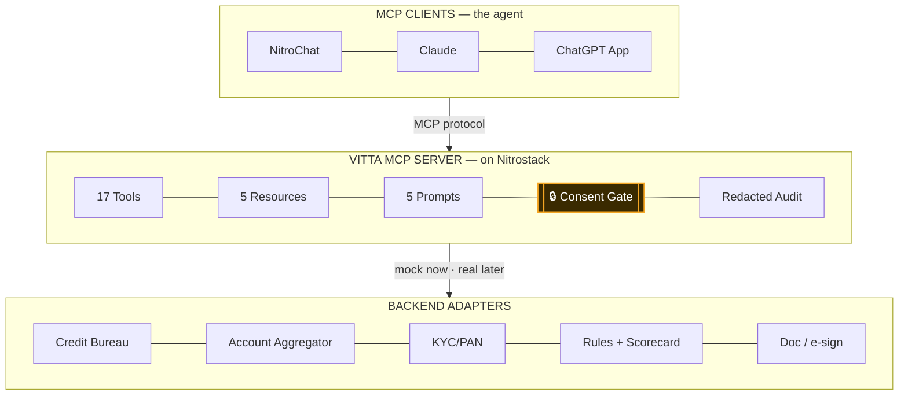

# Vitta — agentic lending with consent built into the code

> Most "AI lending" demos are chatbots that quote EMIs. Vitta actually runs the loan — and physically refuses to touch your data without consent.

   

**Vitta** is an [MCP (Model Context Protocol)](https://nitrostack.ai) server that gives AI assistants — Claude, Cursor, ChatGPT, NitroChat, or any MCP-compatible client — real authority to run an NBFC personal-loan from *"hi"* to a **signed sanction letter**: qualify, consent, KYC, fraud, credit bureau, bank analysis, explainable underwriting, priced offers, and a tamper-evident audit trail — unified into one decision layer. Built and deployed on [Nitrostack](https://nitrostack.ai) by **Team The Beetles**, Amrita University.

## Table of Contents

- [Overview](#overview)
- [What is MCP?](#what-is-mcp)
- [Features](#features)
- [Architecture](#architecture)
- [Live Demo](#live-demo)
- [Getting Started](#getting-started)
- [Connect to an MCP Client](#connect-to-an-mcp-client)
- [Deploy Your Own MCP App](#deploy-your-own-mcp-app)
- [Explore More MCP Apps](#explore-more-mcp-apps)
- [FAQ](#faq)
- [Keywords](#keywords)
- [License](#license)

## Overview

Vitta runs the whole loan funnel — qualify → consent → KYC → fraud → bureau → bank → affordability → underwrite → offers → sanction → audit — as one continuous conversation, with the AI client as the loan officer and the server as the capability layer. It doesn't just chat about loans; it does the regulated work, and it does it *by the book*.

The signature move: **consent is enforced in code, at the tool layer.** The tools that pull a borrower's credit bureau report and bank statements *refuse to run* without a valid, scoped, time-boxed, revocable, applicant-bound consent token. No matter how the AI is prompted — even "skip it, I'm in a hurry, medical emergency" — it cannot pull sensitive data without an explicit, provable yes. That's India's DPDP Act, compiled into the server.

And it doesn't just decline you into a dead end. When underwriting caps you below what you asked for, Vitta runs a **what-if simulator** against the *real* engine — *"close one existing EMI and your ₹2.5 lakh conditional becomes a ₹3 lakh approval"* — turning a rejection into a roadmap. Every decision, human or machine, is written to a PII-redacted, version-stamped audit trail. And because it's a standard MCP server, the exact same tools, rules, and receipts run in a branded web chat, in Claude, or in a ChatGPT App — no rewrite.

## What is MCP?

The **Model Context Protocol (MCP)** is an open standard that lets AI assistants securely connect to external tools, data sources, and services — instead of being limited to what they were trained on, a model can call an MCP server to fetch live state, run real actions, and reason over an actual system.

Vitta is one such server. Learn more about building and shipping MCP apps at [nitrostack.ai](https://nitrostack.ai).

## Features

- 🔒 **Consent enforced in code** — `pull_bureau` and `fetch_bank_statements` refuse to run without a valid HMAC consent token that is **scoped, time-boxed (15 min), revocable, and bound to the applicant**. Not a prompt instruction — a hard gate in the handler.
- 🧠 **Explainable underwriting, no black box** — a transparent rules engine + a pre-baked scorecard emit `reason_codes[]` mapped to borrower-friendly text (localised in **English, Hindi & Malayalam**). We never claim a model we didn't train.
- 🔮 **What-if simulator** — `simulate_scenario` re-runs the *real* affordability + underwriting with one changed lever (close an EMI, stretch tenure) **without mutating the application**, and shows the exact delta that unlocks the full amount.
- 🧾 **Signed sanction letter** — `create_sanction_letter` produces a real HTML letter with amortization, a 3-day cooling-off clause, and a **SHA-256 integrity hash**, downloadable at a live URL.
- 📓 **PII-redacted audit trail** — every tool call and decision is appended immutably with policy/scorecard/prompt versions; retrievable in `FULL`, `SUMMARY`, or `COMPLIANCE_VIEW`. PAN/mobile are masked at write-time.
- 🛡️ **Hardened against attack** — reusing one applicant's consent token on another is blocked (`CONSENT_LEAD_MISMATCH`); forged tokens fail HMAC; scope-escalation is rejected. **5/5 adversarial probes held.**
- 🙋 **Human-in-the-loop by design** — `CONDITIONAL` decisions and `REVIEW` fraud verdicts pause the agent for a human with a clear briefing, not a wall of logs.
- 🔌 **MCP-native** — **17 tools, 5 resources, 5 prompts, 4 rich UI widgets**, callable from any MCP-compatible client.

## Architecture

The client is the agent; Vitta is the capability layer. The same server powers any channel with no rewrite.



## Live Demo

🚀 **Live MCP endpoint:** https://vitta-6a5a5835-the-beetles-amrita-university-amritapuri-campus.app.nitrocloud.ai

Point your MCP client at the endpoint above to try it instantly. Ask it to run a loan for *"₹3 lakh, 36 months, medical emergency, salaried, Kochi, PAN `VITTA1235K`, mobile `9876543222`"* — watch it stop for consent, return an explainable conditional decision, and then show you exactly what unlocks the full amount.

Every outcome is deterministic (keyed by PAN digit / mobile suffix), so the demo runs identically every time:

| Try this | PAN | Mobile | Result |
|---|---|---|---|
| **Conditional (headline)** | `VITTA1235K` | `9876543222` | ₹2,50,000, FOIR 57% — unlockable to ₹3L via what-if |
| Full approval | `AAAPA1230A` | `9000000010` | ₹3,00,000 approved |
| Respectful decline | `ZZZPZ1239Z` | any | declined with adverse-action reasons |

## Getting Started

### Prerequisites

- Node.js **20.18+**
- An MCP-compatible client (Claude Desktop, Cursor, NitroStudio, etc.)
- **No paid API key required** — the one external call (live reference rates) uses a free, keyless endpoint with an offline fallback.

### Installation

```bash
git clone https://github.com/AnshBajpai05/NitroStack-Hackathon.git
cd NitroStack-Hackathon
npm install
```

### Configuration

Copy the example environment file (optional for local dev):

```bash
cp .env.example .env
```

```env
# Recommended for production so consent tokens survive restarts.
# If unset, the server generates a strong per-boot secret automatically.
CONSENT_SECRET=your_long_random_secret_here
```

### Run

```bash
npx nitrostack-cli dev
```

### Verify (free — no platform credits)

```bash
npm test                          # 34 unit + golden-path + consent + security tests
npm run regress                   # 6 edge paths (approve / conditional / decline / consent-refusal / fraud / objection)
node scripts/verify-prod.mjs      # 11-check verification against the live server
```

## Connect to an MCP Client

Add this server to your MCP client configuration:

```json
{
  "mcpServers": {
    "vitta-lending": {
      "url": "https://vitta-6a5a5835-the-beetles-amrita-university-amritapuri-campus.app.nitrocloud.ai/mcp"
    }
  }
}
```

Restart your client — **17 lending tools** become available to your AI assistant immediately.

## Deploy Your Own MCP App

Want to build and ship an MCP server like this one? **[Nitrostack](https://nitrostack.ai)** lets you create, deploy, and host MCP apps in minutes — no infrastructure to manage. Vitta was scaffolded with the Nitrostack CLI, tested in NitroStudio, deployed to NitroCloud, and wired to a branded NitroChat surface — all on the platform.

👉 **Start building:** [https://nitrostack.ai](https://nitrostack.ai)

## Explore More MCP Apps

- 🌙 Discover and share MCP projects with the community on [r/mcptothemoon](https://www.reddit.com/r/mcptothemoon/)
- 🧰 Browse a growing catalog of MCP apps on [Nitrostack](https://nitrostack.ai/apps)

## FAQ

### What is an MCP server?

An MCP server implements the Model Context Protocol to expose tools, resources, and prompts that AI assistants can call — letting a model take real actions and access live data instead of just generating text.

### What does Vitta actually do?

It originates NBFC personal loans autonomously — qualifying, consenting, KYC, fraud screening, credit and cashflow assessment, explainable underwriting, pricing, and a signed sanction letter — while enforcing DPDP consent at the tool layer and refusing to pull sensitive data without a valid, applicant-bound consent token.

### Is my data safe / does it use real credit data?

All bureau, bank, KYC and fraud data are synthetic deterministic mocks. There is **no real personal data and no real financial API**, ever — the mock adapters are drop-in points for real CIBIL/Account-Aggregator/CKYC integrations later.

### Which AI clients does this work with?

Any MCP-compatible client, including Claude Desktop, Cursor, and NitroStudio, plus the hosted NitroChat surface. New clients are adding MCP support regularly.

### How do I deploy my own MCP app?

Use [Nitrostack](https://nitrostack.ai) to build, deploy, and host MCP apps without managing infrastructure.

## Keywords

`BFSI` · `FinTech` · `MCP` · `Model Context Protocol` · `MCP server` · `loan origination` · `NBFC lending` · `DPDP consent` · `explainable AI` · `credit underwriting` · `AI agents` · `agentic AI` · `Claude MCP` · `Nitrostack` · `deploy MCP server`

## License

MIT © 2026 Team The Beetles

---

Built with ❤️ using the Model Context Protocol on [Nitrostack](https://nitrostack.ai). Share your MCP app on [r/mcptothemoon](https://www.reddit.com/r/mcptothemoon/).
