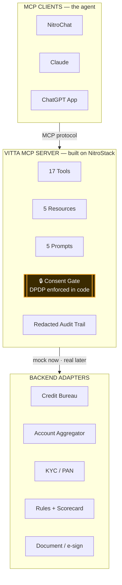

# DIAGRAMS.md — accurate diagrams for the video + write-up

## HOW TO GET PERFECT, ACCURATE IMAGES (recommended)
Paste each Mermaid block at **https://mermaid.live** → it renders instantly with correct labels →
Actions → **PNG** (set a transparent or dark background, 2x scale). These are pixel-accurate and legible.

---

## DIAGRAM 1 — The Complete Flow (the Golden Path)

```mermaid
flowchart LR
  A([qualify_lead]) --> B([record_consent<br/>issues consent token])
  B --> C([verify_kyc])
  C --> D([screen_fraud])
  D --> E([pull_bureau])
  E --> F([fetch_bank_statements])
  F --> G([compute_affordability])
  G --> H([underwrite])
  H --> I([generate_offers])
  I --> J([create_sanction_letter])
  J --> K([log / get_audit_trail])

  classDef gate fill:#3a2a00,stroke:#f5a623,stroke-width:2px,color:#fff;
  classDef issuer fill:#04322e,stroke:#2dd4bf,stroke-width:2px,color:#fff;
  class E,F gate;
  class B issuer;

  E -. "🔒 consent-gated" .- F
```



> Amber = the two consent-gated data-pull tools (refuse without a valid token). Teal = the consent issuer.

---

## DIAGRAM 2 — What We Built (One Server, Many Clients)



> The client is the agent; the server is the capability layer. Same server powers a website, WhatsApp,
> or an underwriter console — no rewrite.

---

## GEMINI IMAGE PROMPTS (stylized hero look — expect it to fumble some text)

> Use these only for an aesthetic background/hero. For anything with readable labels, use the Mermaid above.
> Add to each: *"16:9, dark navy background #0D1117, teal (#2DD4BF) and amber (#F5A623) accents, flat modern
> vector, high text legibility, minimal, professional fintech infographic, no photorealism."*

**Prompt A — the golden path flow:**
```
A clean modern horizontal flowchart infographic of a digital lending pipeline, left to right, eleven
connected rounded-rectangle steps joined by thin arrows, labeled in order: "Qualify Lead", "Record
Consent (issues consent token)", "Verify KYC", "Screen Fraud", "Pull Bureau", "Fetch Bank Statements",
"Compute Affordability", "Underwrite", "Generate Offers", "Sanction Letter", "Audit Trail". The two steps
"Pull Bureau" and "Fetch Bank Statements" each have a small padlock icon and an amber glow to show they are
consent-gated. Title at top: "Vitta — The Golden Path". 16:9, dark navy background #0D1117, teal and amber
accents, flat modern vector, crisp legible sans-serif text, minimal, professional.
```

**Prompt B — what we built (architecture):**
```
A clean modern three-layer architecture diagram infographic connected by vertical arrows. Top layer titled
"MCP Clients — the agent" with three small cards: "NitroChat", "Claude", "ChatGPT App". Middle layer is a
large rounded container titled "Vitta MCP Server — built on NitroStack" containing four pill badges
"17 Tools", "5 Resources", "5 Prompts", "Redacted Audit Trail", and one prominent amber shield badge
"Consent Gate — DPDP enforced in code". Bottom layer titled "Backend adapters — mock now, real later" with
five small labeled icons: "Credit Bureau", "Account Aggregator", "KYC / PAN", "Rules + Scorecard",
"Document / e-sign". 16:9, dark navy background #0D1117, teal and amber accents, flat modern vector,
crisp legible text, minimal, enterprise fintech.
```
